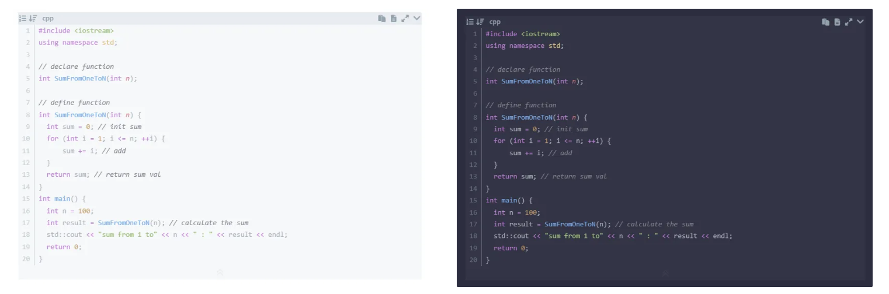
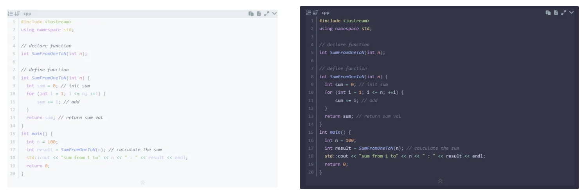
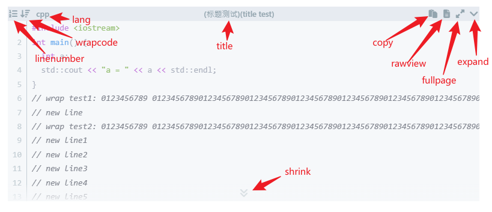
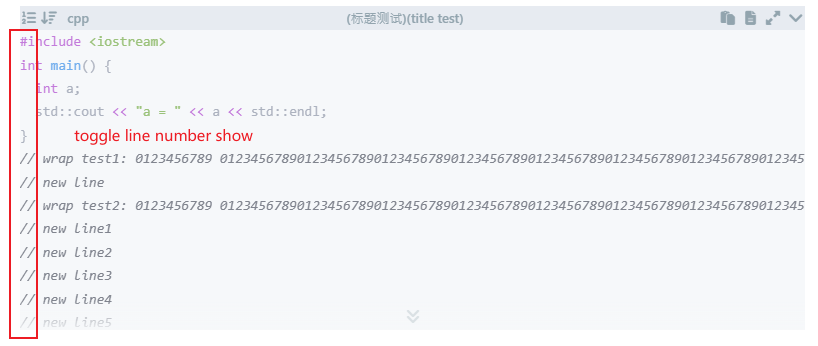
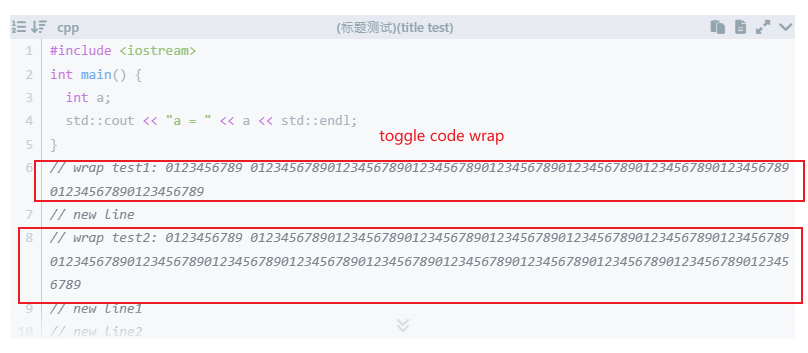
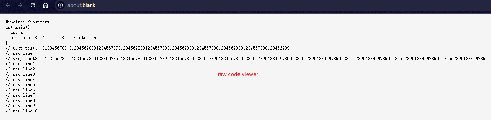
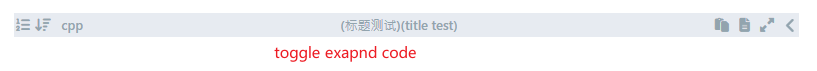
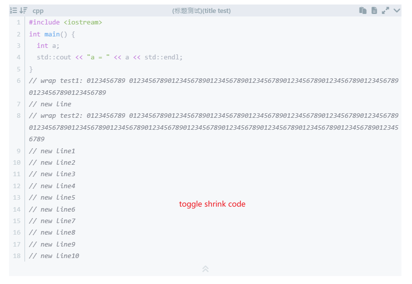

# ✨代码高亮插件

本插件为 Hexo 博客系统提供了一个基于 Shiki 的代码高亮功能，支持多种自定义配置和交互功能，如行号显示、代码折叠、复制代码、全屏查看等。

shiki支持的所有语言查看： [https://shiki.style/languages](https://shiki.style/languages)

shiki支持的所有主题查看： [https://shiki.matsu.io/themes#special-themes](https://shiki.matsu.io/themes#special-themes)

# 🌟预览

theme: **one-dark-pro**

---
theme: **catppuccin-frappe**

---

---

---

---

---

---

---

# 🛠️安装


安装插件
```bash install
npm install https://github.com/gxt-kt/hexo-plugin-shiki.git --save
```

# 📦配置

在_config.yml设置以下内容

> [!WARNING]
> 为了避免与原生代码高亮插件发生冲突，请禁用原生插件。
>
> ```yml
> highlight:
>   enable: false
> prismjs:
>   enable: false
> ```
>
> 对于 `hexo>=7.0.0` 版本，请额外添加一行，将 `syntax_highlighter` 留空，如下所示。
>
> ```yml
> syntax_highlighter:
> ```

添加以下配置：

```yaml config in _config.yml
shiki:
  theme: "one-dark-pro"
  line_number: true # whether to show the linenumber(if set false you can still toggle linenumber show by highlight_linenumber_toggle)
  highlight_linenumber_toggle: true # whether to show the linenumber toggle button
  highlight_wrap_toggle: true # whether to show the wrap code toggle button
  highlight_lang: true # whether to show the code lang name
  highlight_title: true # whether to show the code block title
  highlight_copy: true #  whether to show the copy button
  highlight_raw: true # whether to show the code raw view button
  highlight_fullpage: true # whether to show the fullpage view button
  is_highlight_shrink: true # true: shrink the code blocks | false: expand the code blocks | null: expand code blocks and hide the button
  highlight_height_limit: 300 # code-block max height,unit: px
  copy: # copy message
    success: "Copy Success"
    error: "Copy Error"
    no_support: "Browser Not Support"
  language_aliases: # will map the code style to corresponding name
    cc: "cpp"
    js: "javascript"
    py: "python"
```

| 配置项                            | 示例值                                              | 描述                                                         |
| --------------------------------- | --------------------------------------------------- | ------------------------------------------------------------ |
| **`theme`**                       | `"one-dark-pro"`                                    | 设置代码高亮的主题。Shiki 支持多种主题，您可以根据需要选择其他主题。 |
| **`line_number`**                 | `true`                                              | 是否显示行号。如果设置为 `false`，仍然可以通过 `highlight_linenumber_toggle` 按钮切换行号显示。 |
| **`highlight_linenumber_toggle`** | `true`                                              | 是否显示行号切换按钮。                                       |
| **`highlight_wrap_toggle`**       | `true`                                              | 是否显示代码换行切换按钮。                                   |
| **`highlight_lang`**              | `true`                                              | 是否显示代码语言名称。                                       |
| **`highlight_title`**             | `true`                                              | 是否显示代码块的标题。                                       |
| **`highlight_copy`**              | `true`                                              | 是否显示复制按钮。                                           |
| **`highlight_raw`**               | `true`                                              | 是否显示查看原始代码的按钮。                                 |
| **`highlight_fullpage`**          | `true`                                              | 是否显示全屏查看按钮。                                       |
| **`is_highlight_shrink`**         | `true`                                              | 控制代码块的默认折叠状态：<br> - `true`: 默认折叠代码块。<br> - `false`: 默认展开代码块。<br> - `null`: 展开代码块并隐藏折叠按钮。 |
| **`highlight_height_limit`**      | `300`                                               | 代码块的最大高度，单位为像素 (`px`)。超过此高度的代码块将显示展开按钮。 |
| **`copy.success`**                | `"Copy Success"`                                    | 复制成功时的提示信息。                                       |
| **`copy.error`**                  | `"Copy Error"`                                      | 复制失败时的提示信息。                                       |
| **`copy.no_support`**             | `"Browser Not Support"`                             | 浏览器不支持复制时的提示信息。                               |
| **`language_aliases`**            | `cc: "cpp"`<br>`js: "javascript"`<br>`py: "python"` | 设置代码语言的别名映射。例如，`cc` 将被映射为 `cpp`。        |


---


# 🚀参考
- [https://github.com/nova1751/hexo-shiki-plugin](https://github.com/nova1751/hexo-shiki-plugin)
- [https://github.com/HPCesia/hexo-highlighter-shiki](https://github.com/HPCesia/hexo-highlighter-shiki)
